# SAP Price Updater

## Introduction

This project provides a **desktop utility** for matching SAP article codes against a cost database to retrieve manufacturing cost values. The application bridges the gap between SAP exports and internal cost spreadsheets, automating what would otherwise be a tedious manual lookup process.

The system uses **pandas** for data processing with robust type normalization to handle the various formats article codes can take (integers, floats, scientific notation). A **tkinter/ttk** GUI provides a user-friendly interface with clipboard integration for seamless data transfer.

---

## Features

### Data Processing
- **Smart Article Matching**: Joins SAP article codes with cost database entries
- **Type Normalization**: Handles integers, floats, strings, and scientific notation (e.g., `1.23E+05`)
- **Duplicate Handling**: Automatically removes duplicate article codes from cost file (keeps first match)
- **Invalid Row Filtering**: Removes rows with empty or zero article codes from clipboard data
- **Missing Value Handling**: Articles not found in cost file default to `0`
- **Clipboard Integration**: Paste SAP data directly or copy results back

### User Interface
- **Bilingual Support**: Full English and Spanish interface (switchable at runtime)
- **Flexible Column Selection**: Configure which columns to use for matching after loading files
- **Native Windows Look**: Uses ttk widgets for standard Windows appearance
- **Dual Input Methods**: Load from Excel file or paste from clipboard
- **Results Table**: Interactive treeview display with copy functionality

### Build & Distribution
- **Cross-Platform Builds**: GitHub Actions compiles for Windows, Linux, and MacOS
- **Standalone Executable**: PyInstaller bundles all dependencies
- **Automated Releases**: New builds published on every push to main

---

## Data Flow

```mermaid
flowchart LR
    subgraph Input["Input Sources"]
        COST[("Cost Excel File")]
        SAP_FILE[("SAP Excel File")]
        SAP_CLIP[("SAP Clipboard Data")]
    end

    subgraph CostProcessing["Cost File Processing"]
        LOAD_COST["Load Excel File"]
        NORM_COST["Normalize Article Codes"]
        DEDUP["Remove Duplicate Articles<br/>(keep first)"]
    end

    subgraph SAPProcessing["SAP Data Processing"]
        LOAD_SAP["Load Excel/Parse Clipboard"]
        REMOVE_EMPTY["Remove Empty Trailing Rows"]
        FILTER_INVALID["Filter Invalid Article Rows<br/>(empty, zero, null)"]
        NORM_SAP["Normalize Article Codes"]
    end

    subgraph ColumnConfig["Column Configuration"]
        AUTO_DETECT["Auto-detect Columns"]
        USER_SELECT["User Selects Columns<br/>(Article + Value)"]
    end

    subgraph Merge["Data Merge"]
        LEFT_JOIN["Left Join on Article Code<br/>(preserve SAP order)"]
        FILL_NA["Fill Missing Values with 0"]
    end

    subgraph Output["Output"]
        DISPLAY["Display in Results Table"]
        COPY["Copy to Clipboard"]
    end

    COST --> LOAD_COST
    LOAD_COST --> NORM_COST
    NORM_COST --> DEDUP

    SAP_FILE --> LOAD_SAP
    SAP_CLIP --> LOAD_SAP
    LOAD_SAP --> REMOVE_EMPTY
    REMOVE_EMPTY --> FILTER_INVALID
    FILTER_INVALID --> NORM_SAP

    DEDUP --> AUTO_DETECT
    NORM_SAP --> AUTO_DETECT
    AUTO_DETECT --> USER_SELECT

    USER_SELECT --> LEFT_JOIN
    LEFT_JOIN --> FILL_NA
    FILL_NA --> DISPLAY
    DISPLAY --> COPY
```



**Processing Steps**:
1. Load cost file and SAP data (from file or clipboard)
2. **Filter invalid rows**: Remove trailing empty rows and rows with empty/zero article codes
3. **Configure columns**: Auto-detect or manually select article code and value columns
4. **Normalize article codes**: Convert all formats to consistent strings
5. **Remove duplicates**: Keep first occurrence of duplicate article codes in cost file
6. **Merge data**: Left join SAP articles with cost data (preserves SAP order)
7. **Fill missing values**: Set `0` for articles not found in cost file
8. Display results and enable clipboard copy

---

## Project Structure

```
Sap-Price-Updater/
├── src/
│   ├── main.py           # GUI application (tkinter/ttk)
│   ├── handlers.py       # Data processing logic
│   ├── i18n.py           # Internationalization (English/Spanish)
│   └── test_handlers.py  # Unit tests (60 tests)
├── .github/
│   └── workflows/
│       └── build.yml     # CI/CD pipeline
├── build_exe.ps1         # Build script (Windows)
├── build.sh              # Build script (Linux/MacOS)
├── .gitignore
└── README.md
```

---

## Deployment

### Pre-built Executable
Download the latest version from [Releases](https://github.com/02loveslollipop/Sap-Price-Updater/releases).

### From Source

```bash
# Clone repository
git clone https://github.com/02loveslollipop/Sap-Price-Updater.git
cd Sap-Price-Updater

# Create virtual environment
python -m venv venv

# Activate (Windows)
venv\Scripts\activate
# Activate (Linux/MacOS)
source venv/bin/activate

# Install dependencies
pip install pandas openpyxl

# Run application
python src/main.py
```

### Build Executable

**Windows:**
```powershell
.\build_exe.ps1
```

**Linux/MacOS:**
```bash
chmod +x build.sh
./build.sh
```

Output: `dist/SapPriceUpdater/`

---

## Dependencies

### Runtime
- **Python 3.11+**
- **pandas** - DataFrame operations and Excel I/O
- **openpyxl** - Excel file support
- **tkinter/ttk** - GUI framework (included with Python)

### Development
- **pytest** - Unit testing
- **PyInstaller** - Executable packaging

---

## CI/CD

GitHub Actions workflow provides:

| Stage | Description |
|-------|-------------|
| **Test** | Runs 46 unit tests on every push/PR |
| **Build** | Compiles executables for Windows, Linux, MacOS |
| **Release** | Creates GitHub release with all platform builds |

---

## Getting Started

1. Download executable from [Releases](https://github.com/02loveslollipop/Sap-Price-Updater/releases) or run from source
2. Select your preferred language (English/Spanish) from the dropdown
3. Load your Cost Excel file using the "Browse" button
4. Load SAP data via file selection or clipboard paste
5. Click "Configure Columns" to select which columns to use for matching
6. Click "Process Files" to generate results
7. Click "Copy to Clipboard" to copy results

---

## License

MIT License
